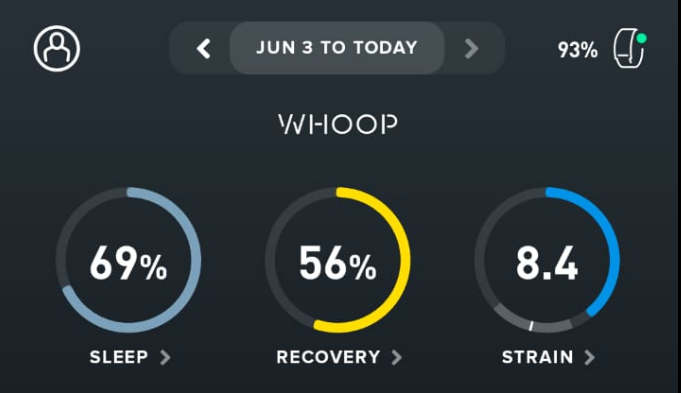
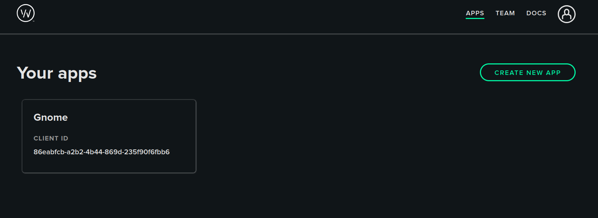
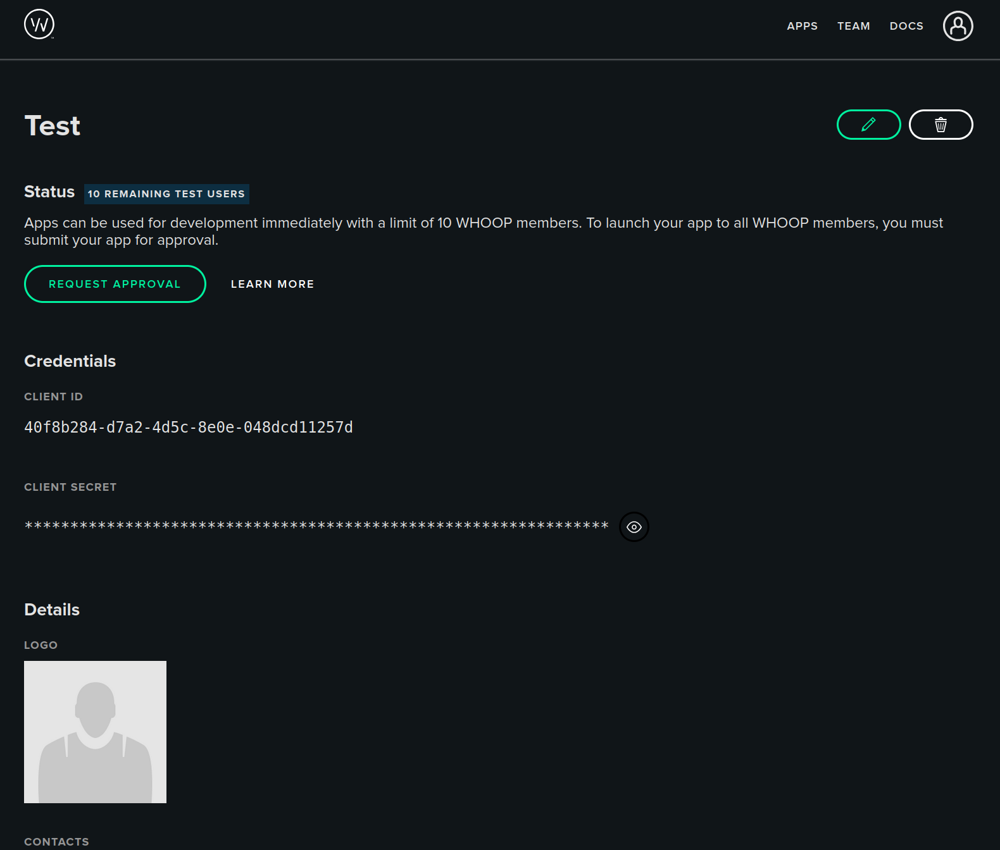

# GNOME Whoop Info Extension

**GNOME Whoop Info** is a GNOME Shell extension that connects to your [WHOOP](https://www.whoop.com/) account and displays your most important daily health metrics directly in the top bar of your GNOME desktop.

Whether you're monitoring your **recovery**, **sleep** and **strain**, this extension gives you a quick and unobtrusive glance at your status—without having to check your phone.

<div align="center">
  
</div>

<div align="center">
  
</div>

---

## ✨ Features

- 📊 **Real-time metrics** - Display recovery score, sleep performance, and daily strain
- 📋 **Detailed info** - Click on the panel to see HRV, resting heart rate, SpO2, calories, and more
- 🔄 **Auto-refresh** - Data updates every 15 minutes and after system resume
- 🔐 **Secure OAuth** - Authentication via WHOOP's official OAuth2 with PKCE
- ⚙️ **Easy setup** - Configure everything from GNOME's extension preferences

---

## 🛠️ Installation

### From GNOME Extensions

Coming soon to [extensions.gnome.org](https://extensions.gnome.org/)

### Manual Installation

1. Clone or download this repository:
   ```bash
   git clone https://github.com/juanmagdev/gnome-whoop-extension.git
   ```

2. Copy to extensions directory:
   ```bash
   cp -r gnome-whoop-extension ~/.local/share/gnome-shell/extensions/whoop-info@juanmag.dev
   ```

3. Compile the GSettings schema:
   ```bash
   glib-compile-schemas ~/.local/share/gnome-shell/extensions/whoop-info@juanmag.dev/schemas/
   ```

4. Restart GNOME Shell:
   - **X11**: Press `Alt+F2`, type `r`, press Enter
   - **Wayland**: Log out and log back in

5. Enable the extension:
   ```bash
   gnome-extensions enable whoop-info@juanmag.dev
   ```

---

## 🔑 Setup & Authentication

### Step 1: Create a WHOOP Developer App

1. Visit the [WHOOP Developer Portal](https://developer.whoop.com/)
2. Log in with your WHOOP account
3. Click **"Create an App"** and fill out the form:

<div align="center">
  
</div>

   | Field             | Value                            |
   |-------------------|----------------------------------|
   | **App Name**      | GNOME Whoop Extension            |
   | **Contact Email** | your@email.com                   |
   | **Privacy Policy**| https://whoop.com                |
   | **Redirect URI**  | `http://localhost:8000/callback` |
   | **Scopes**        | Select all available scopes      |
   | **Webhook URL**   | Leave empty                      |

4. After creating the app, copy your **Client ID** and **Client Secret**

<div align="center">
  
</div>

### Step 2: Configure the Extension

1. Open the extension preferences:
   - Go to **GNOME Extensions** app → Find "Whoop Info" → Click ⚙️

2. In the **Account** tab:
   - Enter your **Client ID** and **Client Secret**
   - Click **"Open Browser"** to start authentication
   - Authorize the app in your browser
   - Copy the callback URL from your browser's address bar
   - Paste it in the **"Callback URL"** field
   - Click **"Complete Setup"**

3. You should see "✓ Connected" - the extension is now ready!

---

## 📋 Requirements

- GNOME Shell 47, 48, or 49
- A WHOOP account and device
- WHOOP Developer App credentials